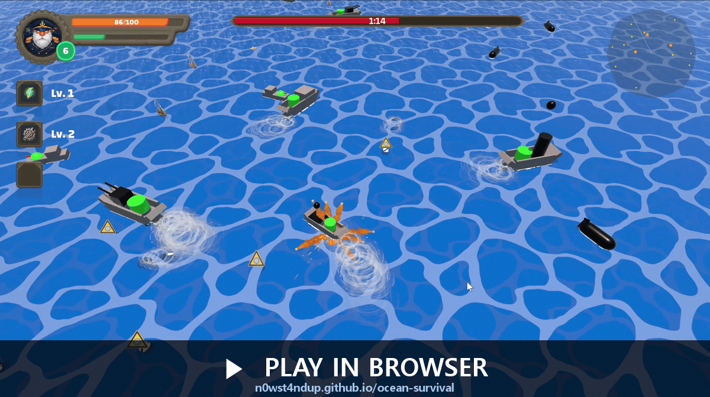
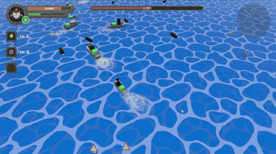
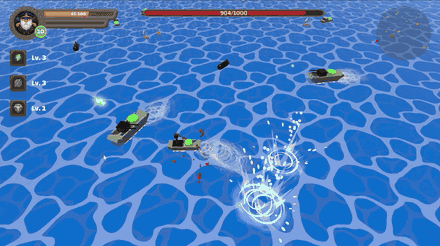
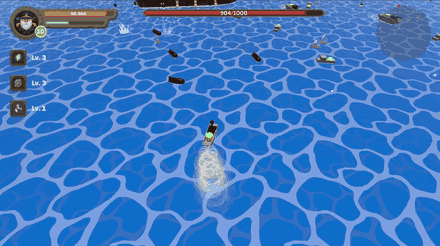
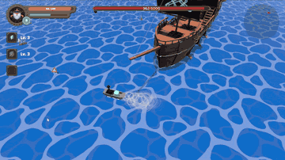
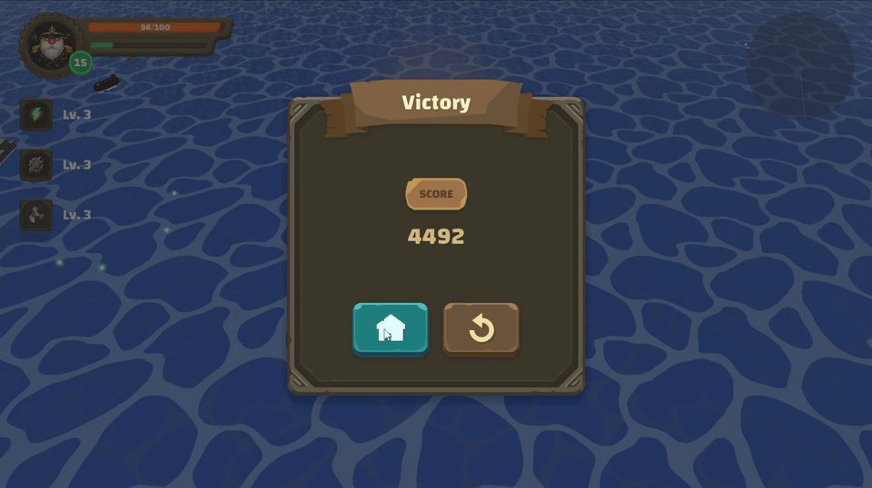

# ShipSurivor

### 배를 몰고, 부품을 줍고, 해적왕을 잡는다

10분 한 판짜리 로그라이트 · 자동 사격 · 브라우저에서 바로 플레이

---

## 어떤 게임인가

밀려오는 적 함대 한복판에서 배 한 척으로 버틴다. 사격은 자동이다. 당신이 정하는 건
**어디로 갈 것인가**와 **무엇을 주울 것인가** 둘뿐이다.

적 중에는 부품을 갖춰 입은 **네임드**가 섞여 있다. 잡으면 달고 있던 것 중 하나를 떨군다.
주워서 내 배에 달면 화력이 붙고, 안 주우면 다른 배가 주워 간다.

3분을 버티면 해적왕이 나온다. 잡으면 클리어. 기록은 초 단위로 남는다.

## 배는 관성으로 움직인다

제자리에서 홱 도는 게 아니다. 속도가 붙어 있으면 그만큼 크게 돈다.
피하려면 **한 박자 먼저** 꺾어야 한다.

| 입력 | 동작 |
| --- | --- |
| `W` 홀드 | 전진 — 떼면 서서히 감속 |
| `S` / `Left Ctrl` | 브레이크 |
| `A` `D` / `←` `→` | 선회 |
| `Esc` | 일시정지 |
| — | 사격은 자동 |

## 부품은 먼저 닿는 쪽이 가진다

덩치가 한 뼘 큰 배가 보이면 **네임드**다. 주포·부포·후방을 무작위로 갖추고 나오기 때문에
일반 적보다 세다.

처치하면 그중 **하나가 무작위로** 바다에 뜬다. 무엇이 나올지는 잡아 봐야 안다.
그리고 **30초 뒤 가라앉는다.**

떨어진 부품은 당신 것이 아니다. 지나가던 다른 네임드가 먼저 닿으면 그쪽이 먹고,
먹은 만큼 강해진 채로 당신에게 온다.

굳이 다 상대할 필요는 없다. 충분히 멀어지면 네임드는 추격을 포기하고 사라진다 —
대신 떨구는 것도 없다.

## 슬롯은 세 칸뿐이다

주포 · 부포 · 후방. 각각 한 칸씩이다.

같은 부위를 또 주우면 그 자리에서 강해진다. 캐넌에 `Double`과 `Triple`이 겹치면
한 번에 **6발**이 나간다.

## 레벨업마다 3장 중 하나

일반 적이 흘리는 EXP를 모으면 화면이 멈추고 카드 세 장이 뜬다.
공격력·사거리·연사 같은 스탯 강화와, 새 부품이 같은 더미에서 나온다.

## 해적왕은 도망칠 수 없다

3분이 지나면 등장한다. 다른 적과 달리 **떨어뜨릴 수 없다** — 당신보다 빠르게 따라온다.

체력이 깎일 때마다 싸우는 방식이 바뀐다. 3단계까지 있다.

## 얼마나 빨리 깼는가

클리어 타임이 남는다. 개인 최고 기록과 전체 순위표에 올라간다.

  
  

## 플레이하기

**[▶ 브라우저에서 바로 플레이](https://n0wst4ndup.github.io/ocean-survival/)** — 설치 없이 실행된다.

브라우저판은 게스트로 시작한다. 기록은 그 브라우저에만 저장되고,
계정 로그인과 전체 순위표는 PC 버전에서 동작한다.

---

Unity 6 (URP) · 3주 1인 개발 · 2026

[개발 문서](Docs/GDD.md) · [보스 설계](Docs/Boss/PirateLord.md) · [밸런싱 기록](Docs/Balancing.md)

